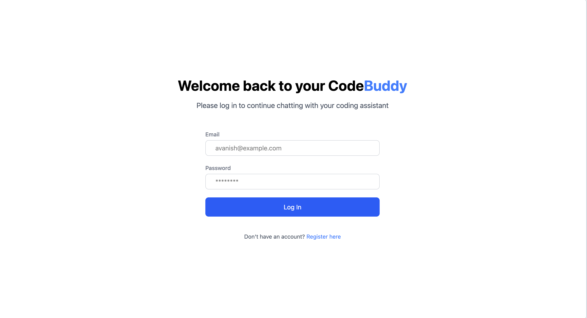
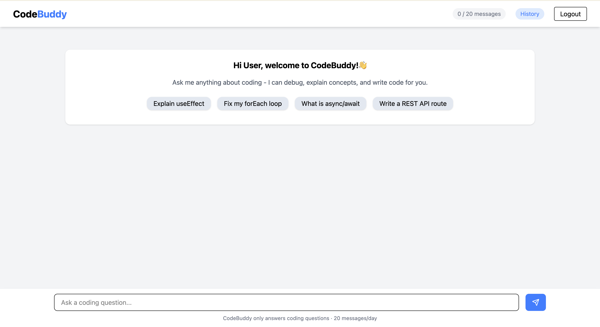
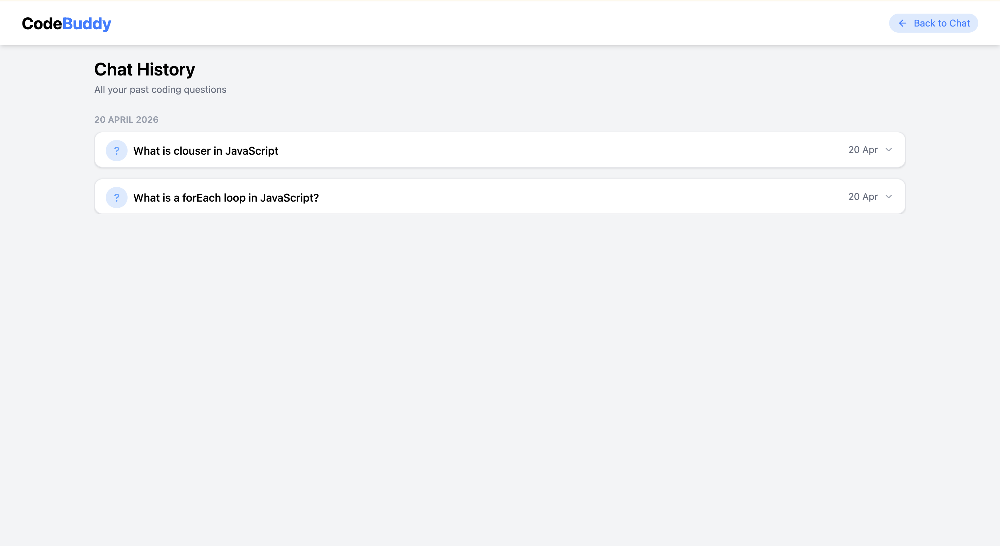

```text
  ____          _      ____            _     _
 / ___|___   __| | ___| __ ) _   _  __| | __| |_   _
| |   / _ \ / _` |/ _ \  _ \| | | |/ _` |/ _` | | | |
| |__| (_) | (_| |  __/ |_) | |_| | (_| | (_| | |_| |
 \____\___/ \__,_|\___|____/ \__,_|\__,_|\__,_|\__, |
                                                |___/
```

## Your AI Coding Assistant

[](https://avanish-codebuddy.vercel.app)
[](https://react.dev)
[](https://vitejs.dev)
[](https://nodejs.org)
[](https://expressjs.com)
[](https://www.mongodb.com)
[](https://jwt.io)
[](https://vercel.com)
[](https://render.com)
[](LICENSE)
[](#author)


## Live Demo
- Live URL: https://avanish-codebuddy.vercel.app
- GitHub Repo: https://github.com/AvanishTiwari18/codebuddy

## About
CodeBuddy is an AI-powered coding assistant web app built for beginner and intermediate developers. It helps users debug code, understand programming concepts, and generate coding solutions with clear responses and syntax-highlighted formatting. The app includes secure authentication, daily usage control, and persistent chat history for a practical learning workflow.

## Features
- 🚀 User registration and login with JWT authentication
- 🤖 AI-powered coding assistant using Groq API (`llama-3.3-70b-versatile`)
- 🧠 Conversation memory with last 10 messages sent as context
- 💾 Persistent chat history saved to MongoDB
- 📆 Daily message limit of 20 messages per user
- 📚 Chat history page with pagination (10 questions per page)
- ❓ Question-answer pairs with expandable answers
- 📝 Markdown rendering with syntax highlighted code blocks
- 📱 Responsive design for mobile and desktop
- 👋 First-time user welcome card with suggestion chips
- 🔄 Returning users load previous chat history on login

## Tech Stack
| Frontend | Backend | Database | AI | Deployment |
|---|---|---|---|---|
| React, Vite, Tailwind CSS, Axios, React Router DOM, React Markdown, React Syntax Highlighter | Node.js, Express.js | MongoDB Atlas, Mongoose | Groq API (`llama-3.3-70b-versatile`) | Frontend: Vercel, Backend: Render |

## Screenshots

### Login Page


### Chat Page


### History Page



## Getting Started

### Prerequisites
- Node.js 18+
- MongoDB Atlas account
- Groq API key

### Clone the Repository
```bash
git clone https://github.com/AvanishTiwari18/codebuddy
cd codebuddy
```

### Setup Server
```bash
cd server
npm install
npm run dev
```

Create a `.env` file in `server/` with the variables shown in the environment table below.

### Setup Client
```bash
cd client
npm install
npm run dev
```

Create a `.env` file in `client/` with the variables shown in the environment table below.

### Environment Variables

#### Server (`server/.env`)
| Variable | Required | Description |
|---|---|---|
| `PORT` | No | Server port (defaults to `8000`) |
| `MONGO_URI` | Yes | MongoDB Atlas connection string |
| `JWT_SECRET` | Yes | Secret used for JWT signing and verification |
| `GROQ_API_KEY` | Yes | Groq API key for AI responses |
| `CORS_ORIGIN` | No | Allowed frontend origin for CORS |

#### Client (`client/.env`)
| Variable | Required | Description |
|---|---|---|
| `VITE_API_URL` | Yes | Backend API base URL (e.g., Render API URL) |

## API Endpoints
| Method | Endpoint | Description | Auth Required |
|---|---|---|---|
| GET | `/` | Health check endpoint | No |
| POST | `/api/auth/register` | Register a new user | No |
| POST | `/api/auth/login` | Login user and return JWT token | No |
| POST | `/api/chat` | Send user message and get AI reply | Yes |
| GET | `/api/chat/history` | Fetch authenticated user chat history | Yes |
| GET | `/api/chat/questions` | Fetch paginated question-answer pairs | Yes |

## Project Structure
```text
codebuddy/
├── client/
│   ├── public/
│   ├── src/
│   │   ├── api/
│   │   ├── components/
│   │   ├── context/
│   │   ├── pages/
│   │   └── utils/
│   ├── index.html
│   ├── package.json
│   └── vite.config.js
├── server/
│   ├── config/
│   ├── middleware/
│   ├── models/
│   ├── routes/
│   ├── server.js
│   └── package.json
└── README.md
```

## How It Works
Users register or log in to receive a JWT token, then ask coding questions in the chat interface. The backend validates the user, enforces a daily 20-message limit, and sends the current prompt plus the last 10 conversation messages to the Groq model for contextual responses. Both user prompts and assistant replies are stored in MongoDB, allowing users to revisit history with paginated question-answer views.

## Future Improvements
- Multiple chat sessions
- Cursor based pagination
- Switch back to Claude API when budget allows
- Dark mode
- Code execution sandbox

## Author
- Built by: Avanish Tiwari
- Role: NxtWave MERN developer
- Status: Currently open to work
- LinkedIn: https://www.linkedin.com/in/avanishtiwari18
- GitHub: https://github.com/AvanishTiwari18/codebuddy

## License
This project is licensed under the MIT License.
